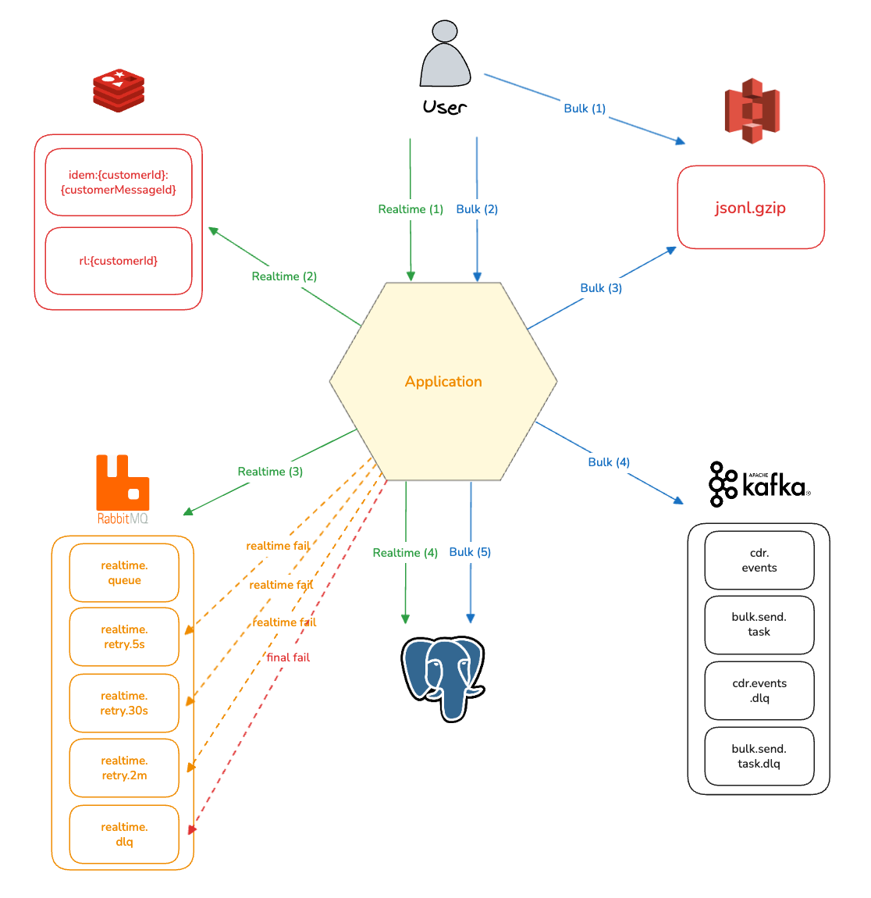
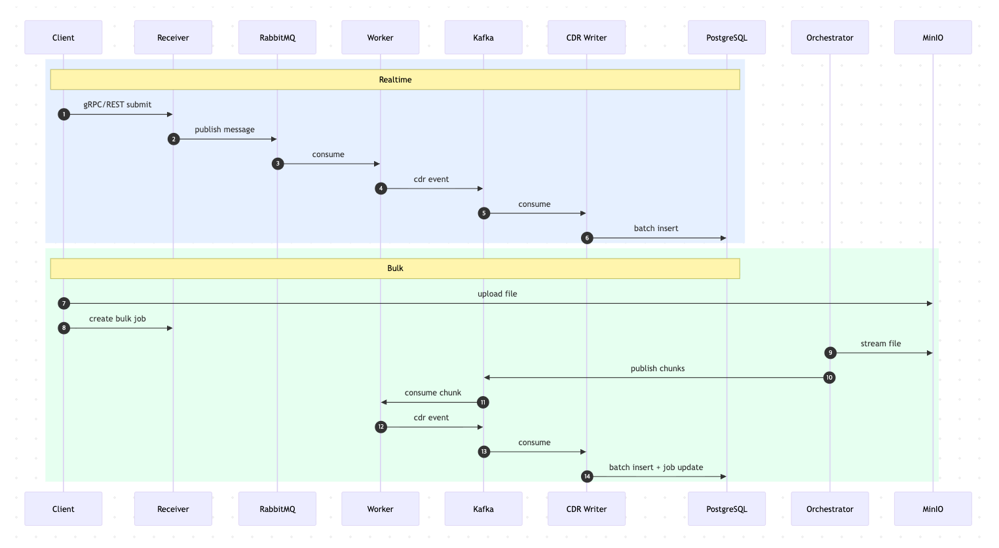
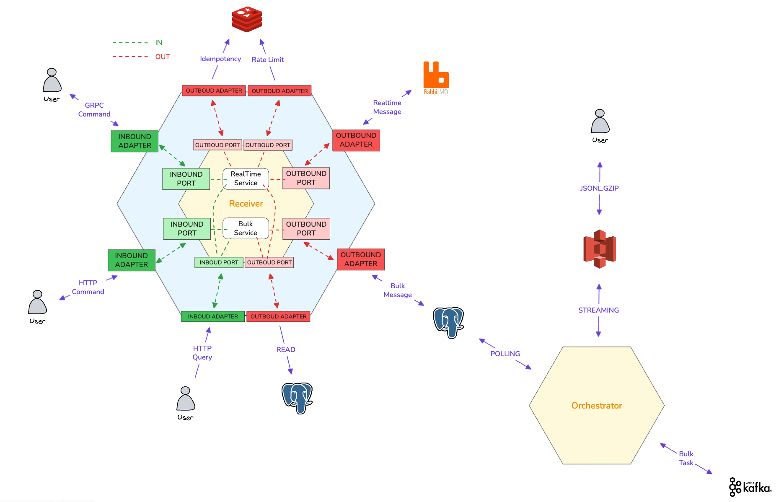
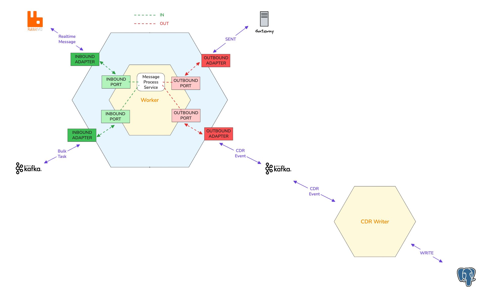
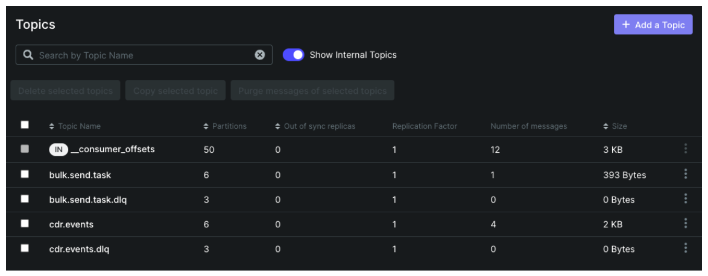
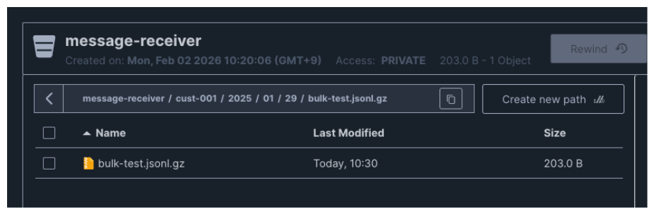
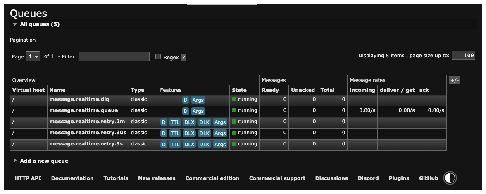

# Message Receiver

> 메시징 시스템 - 실시간(Realtime) 및 대량(Bulk) 메시지 발송 처리

대량 발송을 **확장 가능한 모듈 구조**로 만들고, 요청 폭증 없이 안정적으로 처리하기 위한 메시징 플랫폼입니다.
과거 TCP/Netty 기반 구현에서 대량 발송 시 요청 수가 폭발하던 구조를 개선하고자,
**OBS + gRPC 템플릿 기반으로 대량 발송을 2번의 요청으로** 수행하는 흐름을 설계했습니다.
이벤트 기반 비동기 처리로 **논블로킹**하게 동작하며, DLQ/Retry로 안정성을 확보했습니다.

---

## 프로젝트 배경

- 이전 시스템은 TCP/Netty 기반으로 구현되어 대량 발송 시 요청 수가 발송 건수만큼 증가
- 대량 발송 최적화가 어려워 확장/운영 비용이 커짐
- 이를 개선하기 위해 **역할별 모듈 분리** + **비동기 이벤트 처리** + **안정적인 재시도/DLQ** 구조로 재설계

---

## 주요 기능

### 1. 실시간 발송 (Realtime)
- gRPC/REST 진입점
- Redis 기반 Rate Limit/멱등성 처리
- RabbitMQ → Worker 비동기 발송
- DLQ/Retry 큐로 안전한 재시도

### 2. 대량 발송 (Bulk)
- 파일 업로드(OBS/MinIO) + Job 생성 **2회의 요청**
- Orchestrator가 파일을 청크로 분할하여 Kafka 발행
- Worker에서 템플릿 렌더링 및 발송 처리

### 3. 이벤트 기반 CDR 적재
- Kafka 이벤트 기반으로 비동기 처리 (논블로킹)
- cdr-writer에서 마이크로 배치로 DB 적재

---

## 시스템 구조



### 플로우차트



 

---

## 헥사고날 아키텍처




---

## 프로젝트 구조

```
message-receiver/
├── common/          # 공통 예외, 도메인 enum, 유틸리티
├── receiver/        # gRPC/REST API 진입점
├── worker/          # MQ/Kafka Consumer + Gateway 발송
├── cdr-writer/      # CDR 이벤트 소비 + DB 적재
├── orchestrator/    # Bulk Job 관리
└── docker/          # 로컬 인프라
```

---

## 기술 스택


---

## 모니터링

- Kafka UI: `http://localhost:8080`
- MinIO Console: `http://localhost:9001`
- RabbitMQ Management: `http://localhost:15672`





---

## 실행 방법

### 1. 미들웨어 실행 (Docker)

```bash
docker compose -f docker/docker-compose.yml up -d
```

### 2. Java 실행 (IDE)

IDE에서 아래 모듈을 각각 실행합니다.

- `receiver` (API 진입점)
- `worker` (메시지 발송)
- `cdr-writer` (CDR 적재)
- `orchestrator` (Bulk Job 관리)

---

## 참고 문서

- `docs/ARCHITECTURE.md`
- `docs/FLOWS.md`
- `docs/SPECIFICATION.md`
- `docs/LOCAL_TEST_GUIDE.md`
