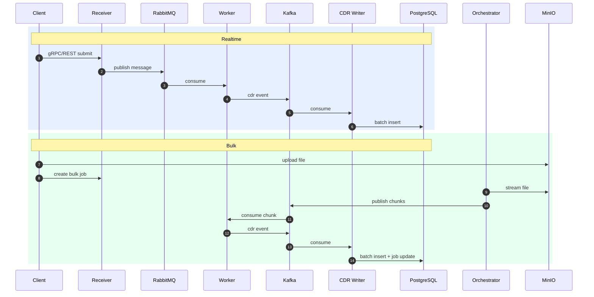
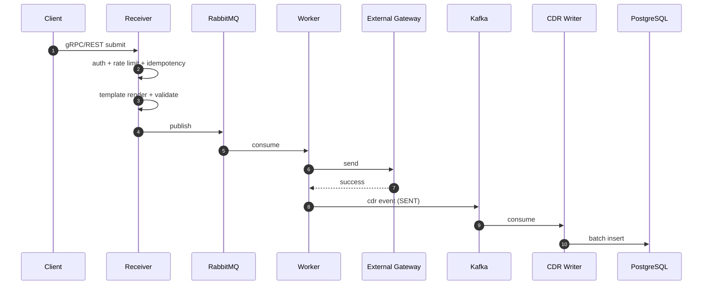
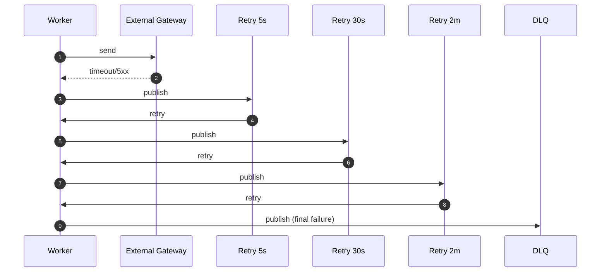
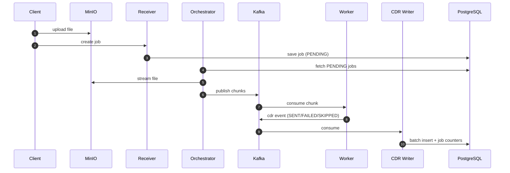
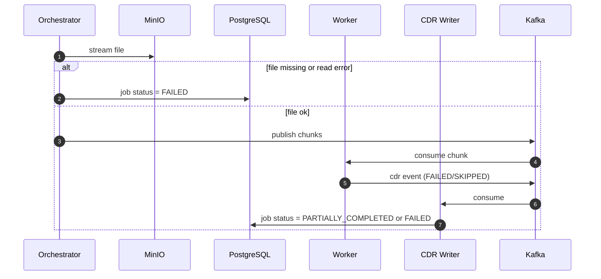

# Flows

## 전체 플로우 (Realtime + Bulk)

```mermaid
sequenceDiagram
    autonumber
    participant Client as Client
    participant Receiver as Receiver
    participant MQ as RabbitMQ
    participant Worker as Worker
    participant Kafka as Kafka
    participant CDR as CDR Writer
    participant DB as PostgreSQL
    participant Orch as Orchestrator
    participant OBS as MinIO

    rect rgb(230, 240, 255)
        Note over Client,DB: Realtime
        Client->>Receiver: gRPC/REST submit
        Receiver->>MQ: publish message
        MQ->>Worker: consume
        Worker->>Kafka: cdr event
        Kafka->>CDR: consume
        CDR->>DB: batch insert
    end

    rect rgb(230, 255, 240)
        Note over Client,DB: Bulk
        Client->>OBS: upload file
        Client->>Receiver: create bulk job
        Orch->>OBS: stream file
        Orch->>Kafka: publish chunks
        Kafka->>Worker: consume chunk
        Worker->>Kafka: cdr event
        Kafka->>CDR: consume
        CDR->>DB: batch insert + job update
    end
```

## Realtime Happy Case

```mermaid
sequenceDiagram
    autonumber
    participant Client as Client
    participant Receiver as Receiver
    participant MQ as RabbitMQ
    participant Worker as Worker
    participant Gateway as External Gateway
    participant Kafka as Kafka
    participant CDR as CDR Writer
    participant DB as PostgreSQL

    Client->>Receiver: gRPC/REST submit
    Receiver->>Receiver: auth + rate limit + idempotency
    Receiver->>Receiver: template render + validate
    Receiver->>MQ: publish
    MQ->>Worker: consume
    Worker->>Gateway: send
    Gateway-->>Worker: success
    Worker->>Kafka: cdr event (SENT)
    Kafka->>CDR: consume
    CDR->>DB: batch insert
```

## Realtime Issue Case (Gateway 실패 + Retry/DLQ)

```mermaid
sequenceDiagram
    autonumber
    participant Worker as Worker
    participant Gateway as External Gateway
    participant Retry5 as Retry 5s
    participant Retry30 as Retry 30s
    participant Retry2m as Retry 2m
    participant DLQ as DLQ

    Worker->>Gateway: send
    Gateway-->>Worker: timeout/5xx
    Worker->>Retry5: publish
    Retry5->>Worker: retry
    Worker->>Retry30: publish
    Retry30->>Worker: retry
    Worker->>Retry2m: publish
    Retry2m->>Worker: retry
    Worker->>DLQ: publish (final failure)
```

## Bulk Happy Case

```mermaid
sequenceDiagram
    autonumber
    participant Client as Client
    participant OBS as MinIO
    participant Receiver as Receiver
    participant Orch as Orchestrator
    participant Kafka as Kafka
    participant Worker as Worker
    participant CDR as CDR Writer
    participant DB as PostgreSQL

    Client->>OBS: upload file
    Client->>Receiver: create job
    Receiver->>DB: save job (PENDING)
    Orch->>DB: fetch PENDING jobs
    Orch->>OBS: stream file
    Orch->>Kafka: publish chunks
    Kafka->>Worker: consume chunk
    Worker->>Kafka: cdr event (SENT/FAILED/SKIPPED)
    Kafka->>CDR: consume
    CDR->>DB: batch insert + job counters
```

## Bulk Issue Case (파일 오류/부분 실패)

```mermaid
sequenceDiagram
    autonumber
    participant Orch as Orchestrator
    participant OBS as MinIO
    participant DB as PostgreSQL
    participant Worker as Worker
    participant CDR as CDR Writer
    participant Kafka as Kafka

    Orch->>OBS: stream file
    alt file missing or read error
        Orch->>DB: job status = FAILED
    else file ok
        Orch->>Kafka: publish chunks
        Kafka->>Worker: consume chunk
        Worker->>Kafka: cdr event (FAILED/SKIPPED)
        Kafka->>CDR: consume
        CDR->>DB: job status = PARTIALLY_COMPLETED or FAILED
    end
```
